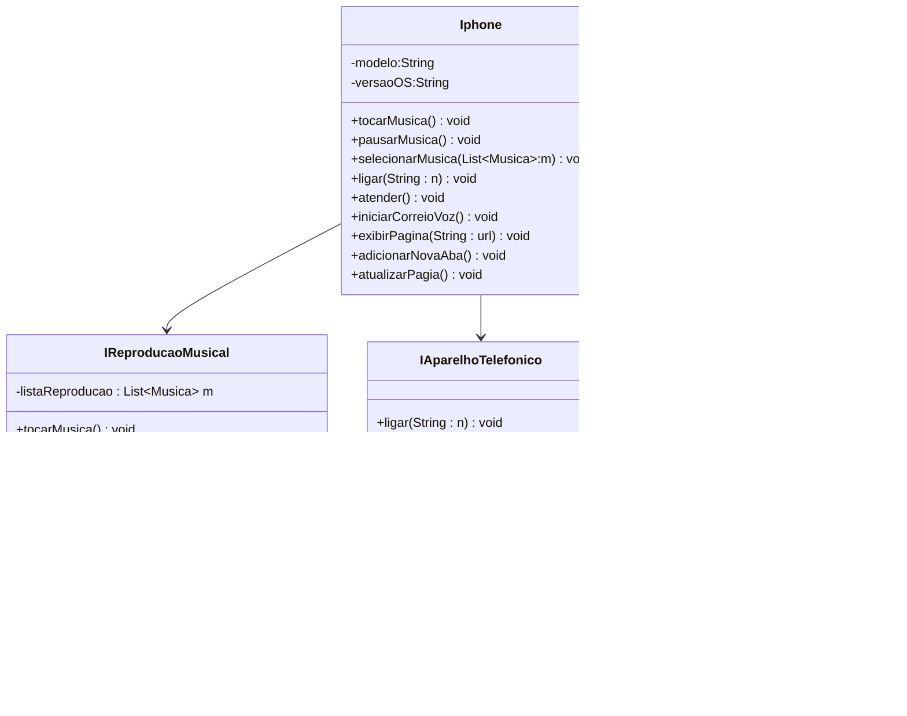

# uml-iphone

```mermaid
classDiagram
  class IReproducaoMusical{
      -listaReproducao : List~Musica~ m
      +tocarMusica()void
      +pausarMusica()void
      +selecionarMusica(List~Musica~:m)void
  }
  class IAparelhoTelefonico{
    +ligar(String : n) void
    +atender() void
    +iniciarCorreioVoz()  void
  }

  class INavegadorInternet{
    +exibirPagina(String : url) void
    +adicionarNovaAba() void
    +atualizarPagia() void
  }

  class Iphone {
    -modelo:String
    -versaoOS:String
    +tocarMusica()void
    +pausarMusica()void
    +selecionarMusica(List~Musica~:m)void
    +ligar(String : n) void
    +atender() void
    +iniciarCorreioVoz()  void
    +exibirPagina(String : url) void
    +adicionarNovaAba() void
    +atualizarPagia() void
  }

  class Musica {
    -nomeMusica:String
    -artista:String
    -anoLancamento:String
    -isFavorito:Boolean
    +favoritar()void
  }

  Iphone --> IReproducaoMusical
  Iphone -->  IAparelhoTelefonico
  Iphone --> INavegadorInternet
  IReproducaoMusical o-- Musica
```
